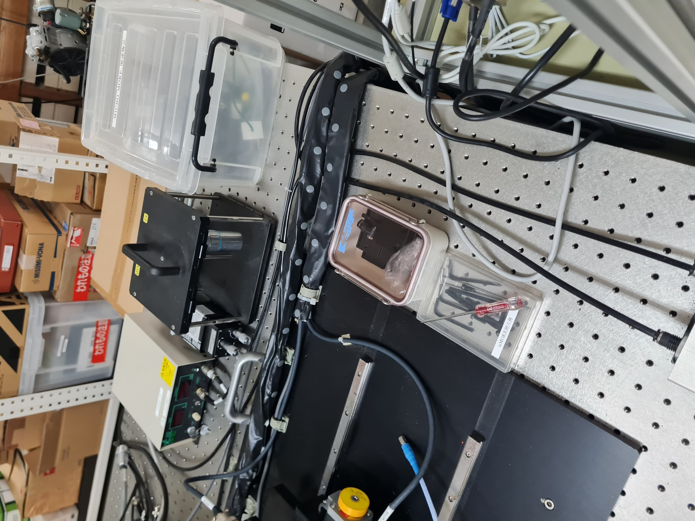

# microMOKE

### Store the objective lens here

## Turn on the system in this order

1. Fuse
2. PSU for the system
3. Laser preAMP
4. Detector
5. Bipolar power supply

## Turn on the PC

## Turn on the laser

1. Push the green button 
2. Turn the key in the laser power supply controller
3. Gradually turn up the laser power until it reaches 33mW

## Start the MOKE software

## Return to origin

1. Push return to origin
2. Click button for OK

## Turn on LED for light source

1. Flip the button at the back
2. and then adjust the level on the knob
3. 

## Place sample in

1. Remove the YOKE on the objective (carefully)
2. Move the system out to the max (20 mm)
3. Place sample using double sided tape
4. Replace the YOKE and tighten the screws back

## Get the sample in focus

1. Make the spot circular

## Setup a measurement

